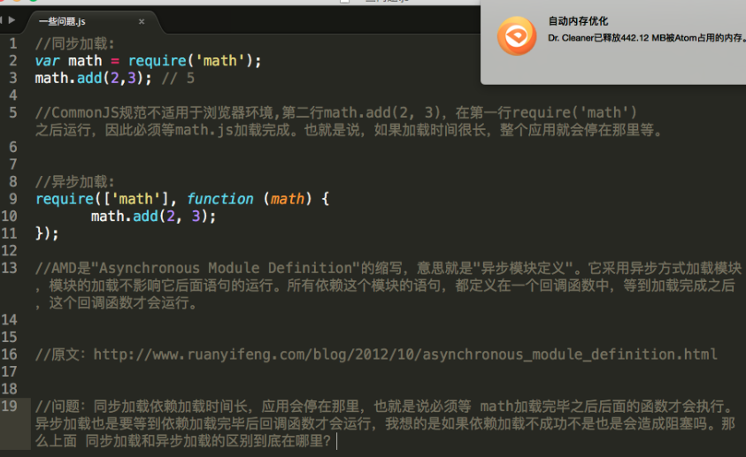

### 解释一：
如果依赖环境加载不成功是不会造成阻塞的，因为math.add()调用与math模块加载不是同步的，也就是说JavaScript脚本在执行的时候，会先加载math模块，而后会将回调放置在任务队列里，转而继续加载其他模块，比如B模块，如果B模块有回调，同理也会将回调放置在任务队列里，继续加载C模块，依次执行，当主线程的任务加载完成时，JavaScript会通过事件轮询任务队列，将任务队列的准备好的事件依次推入主线程再依次执行。
AMD的异步加载是基于模块与模块之间去思考的;即JavaScript的单线程特性，需要基于异步编程实现非阻塞的特性，故而执行模式可以分为同步和异步。异步的任务执行是放置在任务队列，需要等待主线程加载完成，才会执行任务队列的任务。异步加载的优点即是不阻塞JavaScript进程。

### 解释二：

##### 单线程
JavaScript是单线程的，即只在一个线程上运行，也就是说，同时只能执行一个任务，其他任务都必须在后面排队等待。
这种问题会导致只要有一个任务耗时很长，后面的任务都必须排队等着，会拖延整个程序的执行。常见的浏览器无响应，往往就是因为某一段JavaScript代码长时间运行（比如死循环），导致整个页面卡死在这个地方，其他任务无法执行.
示例代码:

```js
var math = require('math');
math.add(2,3);
function fn(){
  //do something
}
// 如果 require('math') 加载时间过长，则 fn的执行会一直排队等待...
fn();
```

##### 任务队列
从浏览器开始加载一个JavaScript脚本，程序的一部分现在运行，而另外一部分则在将来运行--现在和将来之间有段间隙，在这段间隙中，程序没有活跃执行。事实上，程序中现在运行的部分和将来运行的部分之间的关系就是异步编程的核心。
于是任务的执行模式分成两种:

- 同步：指的是在JavaScript执行进程上排队执行的任务，只有前一个任务执行完毕，才能执行后一个任务。
- 异步：指的是不进入JavaScript执行进程，而进入任务队列的任务，只有任务队列通知主进程，某个异步任务可以执行了，该任务（采用回调函数的形式）才会进入JavaScript进程执行。

JavaScript单线程则意味着所有同步任务都在主线程执行，但在主线程之外还存在一个任务队列；在任务队列就是你在主线程上的一切调用。        
